# Thesis Results Consolidation — Scientific Story

> **Supersession note (2026-09-24):** V2-C closed at the authority gate and V2-H closed at its parameter-direction-diversity gate. A final combination-rescue branch, V2-K, then combined continuous preference coefficients with genuinely private residual modules. K0 passed exact function preservation and K1 passed every private-subspace authority/diversity gate, but K2 failed the unchanged semantic contract: only Tracking passed, while continuum monotonicity and endpoint-between fell to 0.60417 and 0.39583. The V2-B + Foundation V2 + λ=.95 + no-retention configuration therefore remains the final reference.

> **Final optimization-objective note (2026-09-24):** A max-min competence-floor audit then repaired the local per-objective gradient geometry decisively: worst normalized predicted gain changed from -0.290 to +0.279 and all four predicted objective gains were non-negative in 8/8 frozen diagnostic cases. A paired u50→u75 pilot preserved this property on 25/25 treatment updates with matched step norm and valid Foundation V2, yet Orientation semantic competence was lost at every completed post-start treatment checkpoint (steps 5/10/15/20). The predeclared retention gate became mathematically impossible before final evaluation, so the branch was stopped. This establishes that repairing instantaneous per-objective gradient conflict alone is insufficient to prevent closed-loop semantic forgetting.

> **Trajectory-objective sufficiency note (2026-09-24):** A read-only audit over 16 finite policy transitions (64 axis-transition samples) then separated local objective validity from trajectory-level semantic sufficiency. Changes in normalized training-objective return had weak rank alignment with both semantic objective margins (Spearman 0.251) and physical semantic margins (0.230). When an objective return improved, its semantic objective margin still deteriorated in 42.3% of cases and its physical semantic margin deteriorated in 38.5% of cases. Therefore local objective semantics remain validated, but trajectory-level semantic sufficiency is not validated.

> **Trajectory-information attribution note (2026-09-24):** Replaying the same policy paths with per-step matched heavy-versus-center traces showed that relational temporal persistence tracks semantic changes far better than the heavy-only scalar return. Late objective/physical advantage had Spearman correlations of 0.872/0.874 with semantic-margin changes, late-minus-early physical advantage reached 0.882, and late relational advantage deteriorated in all 9 observed PASS-to-FAIL transitions. Generic heavy-only tail statistics were weaker. The strongest missing information class is therefore the persistence of heavy-versus-center advantage over the trajectory, especially late in the rollout. Reward redesign remains unvalidated.

> **Held-out relational validation note (2026-09-24):** A strict held-out rerun on three independent weighted-PPO control seeds (24 transitions, 96 axis-transitions) reproduced the missing relational signal. Heavy-only objective return correlated only moderately with objective correctness changes (Spearman 0.409), while mean heavy-versus-center objective and physical advantages reached 0.732 and 0.754. All six frozen relational-temporal descriptor groups exceeded |rho|=0.50, and late objective and physical advantages deteriorated in all 14 held-out PASS-to-FAIL events. However, temporal descriptors did not exceed the relational mean by the predeclared +0.10 margin. Therefore relational contrast is held-out validated, while temporal persistence remains a strong event-sensitive secondary signal whose incremental value is not yet isolated; reward redesign remains blocked.

> **Relational-objective design note (2026-09-24):** An offline audit of `J_H + eta(J_H-J_C)` with eta in {0.25,0.5,1.0} confirmed that relational augmentation improves semantic alignment, but no scalar weighting passed all predeclared criteria. Eta=.5 reduced center-degradation false gains to 3.6% while raising objective-correctness Spearman to 0.559, yet still falsely approved 28.6% of PASS-to-FAIL events even after a strict non-degrading-heavy-performance guardrail. Some forgetting events occurred with both Delta J_H>0 and Delta(J_H-J_C)>0. Relational information is therefore informative but not a sufficient scalar training objective.

> **Semantic-gate factorization note (2026-09-24):** Factorization over the strict three-seed held-out set showed that suite or phase context collapse accompanied 85.7% of 14 PASS-to-FAIL events and every forgetting event contained a context-level sign loss. Mean relational deterioration was also present in 85.7% of events, so context-distributional failure was not established as the dominant mechanism. Two counterexamples nevertheless lost semantic PASS while both objective and physical mean heavy-versus-center relations improved; one was explained by increased objective-physical disagreement and the other by worst-suite collapse with growing heterogeneity. Thus mean relation remains the strongest scalar indicator but is not sufficient for all contexts.

> **Prospective context-retention note (2026-09-24):** A causal-clean follow-up used only source checkpoints that were already PASS and asked whether suite-by-phase robustness predicted retention at the next checkpoint beyond source mean relational margins. Only 18 PASS-origin transitions were available (14 forgetting, 4 retained), below the predeclared sample minimum. The context-augmented leave-one-seed-out model did not improve prospective metrics: pooled ROC AUC fell from 0.411 to 0.339 and Brier score worsened from 0.251 to 0.276. The branch is therefore underpowered/inconclusive, with no incremental context intervention authorized.

> **Phase-1 semantic-target design note (2026-09-24):** A discovery-calibrated, held-out-tested conjunctive target combining standardized objective and physical heavy-versus-center margins achieved strong semantic alignment (Spearman 0.813) but provided no material gain over the objective-relation control (0.804) or arithmetic two-channel relation (0.815). PASS-to-FAIL false approval remained 14.3% for all relational candidates, and the two residual false approvals were the same context-sensitive Smoothness and Tracking counterexamples identified earlier. The predeclared Stage-A target gate therefore failed and no training pilot was authorized.

> **Preference-to-behavior ordering note (2026-09-24):** The exact five-point continuum audit was completed over all 25 held-out checkpoints with raw trajectory caching. Primary joint interior ordering deteriorated in 71.4% of 14 PASS-to-FAIL events, below the 75% gate and below the 85.7% sensitivity of the mean relational control. No PASS-to-FAIL event showed ordering deterioration while both mean objective and physical relations were non-decreasing, and the primary ordering-change correlation with semantic-score change was only 0.299. The two residual mean-relation counterexamples actually showed improving joint ordering. The ordering hypothesis therefore failed and no ranking intervention was authorized.

> **Semantic-gate robustness note (2026-09-24):** Continuous-margin analysis verified that the frozen 3-of-4 suite PASS rule is exactly represented by the minimum of objective/physical second-smallest normalized suite margins. Across 14 held-out PASS-to-FAIL events, the median gate margin moved from +0.459 to -2.474; 64.3% remained flips under normalized threshold perturbations of ±0.25 and 92.9% had exact paired-bootstrap flip probability >=0.50. At the same time, 28.6% had boundary clearance below 0.10. The evidence therefore indicates substantial real semantic collapse with a material near-boundary subset rather than a purely threshold-driven artifact. One residual Smoothness failure was boundary-sensitive, while the residual Tracking failure remained robust.

> **Held-out relational-persistence note (2026-09-24):** Strict held-out validation on three unseen weighted-PPO training seeds (24 transitions, 96 axis-transition samples) reproduced the relational advantage but refined the mechanism. Heavy-only objective return aligned weakly with semantic correctness changes (Spearman 0.409), as did heavy-only late statistics (0.420 objective / 0.358 physical). In contrast, matched heavy-versus-center mean relation reached 0.732 / 0.754, while late relational advantage reached 0.658 / 0.681. All six relational-temporal descriptor groups reproduced above |rho|=0.50, and late relational objective+physical advantage deteriorated in all 14 held-out PASS-to-FAIL events versus 9/14 for J-heavy. However, temporal descriptors did not beat relational mean by the predeclared +0.10 margin. The diagnosis therefore narrows to relationality as the primary missing information and temporal persistence as a secondary forgetting-sensitive refinement. Reward redesign remains blocked.

Status: **THESIS CONSOLIDATION SOURCE — METHOD SEARCH CLOSED; TRAJECTORY SUFFICIENCY REJECTED; HELD-OUT DATA IDENTIFY RELATIONALITY AS PRIMARY MISSING INFORMATION AND TEMPORAL PERSISTENCE AS SECONDARY; REWARD REDESIGN BLOCKED; FINAL REFERENCE FIXED**

Date: 2026-09-24

This document converts the completed experimental evidence chain into a thesis-ready structure. It separates validated mechanism findings from negative method results and fixes the final reference configuration.

---

# 1. Final reference method

The final evaluated reference configuration is:

- **V2-B single-site FiLM preference-conditioned actor**
- **Foundation V2**
- validated normalized 4D objective formulation
- repaired squashed PPO action/log-prob semantics
- shared critic body with objective-specific heads
- reset-diverse / expanded current-policy critic support
- validated critic freshness checks
- **GAE lambda = 0.95**
- **no retention intervention**

The final method is selected as the cleanest validated architecture/foundation configuration, not because it completely solves semantic preference control.

---

# 2. Master result table

## 2.1 Architecture / semantic-control progression

| Stage | Preference mechanism | Foundation validity | Preference authority | Endpoint semantic result | Continuum monotonicity | Endpoint-between | Main conclusion |
|---|---|---|---|---:|---:|---:|---|
| Historical V1/V2 | earlier direct / complex conditioning | confounded | not interpretable causally | historical failures | — | — | cannot rank architecture because reward/PPO/critic confounds remained |
| RV1 | direct 4D preference conditioning | **validated** | present | **0/4 endpoint passes** | 0.60938 | 0.40278 | direct conditioning uses preference but is semantically insufficient |
| V2-A | RV1 direct path + learned preference embedding | Foundation V2 | **embedding authority validated** | **1/4 pass (Tracking)** | 0.62500 | 0.47917 | embedding improves expressivity/interpolation but does not yield complete semantics |
| V2-B | RV1 + embedding + single-site FiLM | Foundation V2 | **FiLM authority validated** | **1/4 pass (Angular)** | **0.64583** | **0.52083** | best tested architecture/interpolation, but 4D semantic control remains incomplete |

Supporting V2-B guardrails:
- survival = 1.0
- max tracking ratio to center = 1.0281
- critic H32 EV mean = 0.3335
- critic negative fraction = 0.0875
- critic mean absolute bias = 0.0344

Interpretation:

> Increasing conditioning expressivity progressively increased behavioral differentiation and continuum quality, but endpoint semantic correctness did not accumulate across objectives. The failure therefore cannot be reduced to an inactive conditioning pathway.

## 2.2 Temporal-credit / optimizer / geometry diagnosis

| Branch | Finding | Final status |
|---|---|---|
| Lambda / effective horizon | lambda=1.0 is closer to MC32 local gradient geometry than 0.95 | diagnostic finding retained |
| Lambda-only training intervention | better local estimator geometry did not establish a superior final trained method | branch closed; final reference returns to lambda=0.95 |
| Static mixed-batch geometry | does not explain semantic collapse by itself | closed |
| Joint objective interference | no simple static gradient-conflict explanation | closed |
| State-fixed local credit | no monotonic late local-credit collapse sufficient to explain behavior | closed |
| Visitation distribution | contributes to path dependence / realized semantics | retained as mechanism evidence |
| Parameter path / optimizer history | path dependence exists, but optimizer history is not a complete causal explanation | closed |
| Stochastic-vs-deterministic gradient audit | corrected per-state chain rule resolves apparent structural mismatch; finite-variance residual converges toward deterministic limit | closed / frozen |

## 2.3 Retention progression

| Retention candidate | Optimization behavior | Semantic-retention outcome | Decision |
|---|---|---|---|
| Gradient retention | optimization remains possible | insufficient competence retention | reject |
| Hard action retention | protects local behavior | restricts plasticity | reject |
| Hard short-trajectory retention | stronger local preservation | stronger plasticity loss; incomplete semantics | reject |
| Soft Delta-a, fixed beta | full step magnitude | rehearsal gradient dominates direction | reject |
| **Bounded auxiliary gradient** | **stable; no hijack; plasticity preserved** | mechanism only | **validated safety mechanism** |
| Bounded Delta-a | estimator stable; budget controlled | +2, -2, -1 paired PASS-event effects over 3 seeds | no robust efficacy |
| Semantic-outcome score-function | budget controlled | gradient direction non-reproducible | reject |
| Semantic-outcome pathwise FD | different estimator family | direction still non-reproducible | reject |
| Semantic-outcome deterministic surrogate | gradient more reproducible | held-out semantic fidelity fails | reject |
| DER-style diverse replay adaptation | optimization stable | 5 PASS vs control 4; lower mean semantic score 0.445 vs 0.453 | fail short gate |
| Multi-timescale Policy Consolidation adaptation | optimization stable | 4 PASS vs control 4; mean semantic score 0.391 | fail short gate |

### Multi-seed bounded Delta-a confirmation

| Seed | Control PASS events | Bounded Delta-a PASS events | Paired effect | Mean semantic-score effect |
|---|---:|---:|---:|---:|
| 980001 | 4 | 6 | +2 | +0.00391 |
| 981001 | 9 | 7 | -2 | -0.00781 |
| 982001 | 7 | 6 | -1 | -0.01953 |
| **Aggregate** | **20** | **19** | **mean -0.333** | **mean -0.00781** |

Validated bounded-budget behavior across seeds:
- mean cosine between mixed and total gradient = 0.9745
- minimum mixed-total cosine = 0.9698
- preference separation effectively unchanged
- active auxiliary updates bounded near rho = 0.25
- no parameter-step collapse
- no preference-authority collapse

Interpretation:

> The stability-plasticity problem of rehearsal was solved at the optimization level, but the tested retained objects and literature-guided retention principles did not produce robust preservation of semantic competence.

---

# 3. Causal / evidence figure

The thesis should present one causal figure with three horizontal layers: foundation repair, architecture escalation, and retention diagnosis.

```mermaid
flowchart LR
    A[Historical preference failures] --> B[Foundation audit]
    B --> B1[Reward / objective semantics repaired]
    B1 --> B2[PPO action-logprob semantics repaired]
    B2 --> B3[Critic freshness + reset-diverse support repaired]
    B3 --> C[Validated Foundation V2]

    C --> D[RV1: direct conditioning]
    D -->|0/4 semantic passes| E[V2-A: preference embedding]
    E -->|authority gain; 1/4 pass| F[V2-B: single-site FiLM]
    F -->|best continuum metrics; 1/4 pass| G[Semantic forgetting / path dependence diagnosis]

    G --> H1[Gradient retention]
    H1 --> H2[Hard action retention]
    H2 --> H3[Hard trajectory retention]
    H3 --> H4[Soft rehearsal: fixed beta]
    H4 -->|gradient takeover| H5[Bounded auxiliary-gradient budget]
    H5 -->|optimization stability solved| H6[Bounded Delta-a]
    H6 -->|no multi-seed efficacy| H7[Semantic-outcome rehearsal]
    H7 -->|score + pathwise unstable| H8[Deterministic surrogate]
    H8 -->|held-out fidelity fails| H9[Literature-guided round]

    H9 --> L1[DER-style diverse replay]
    H9 --> L2[Policy Consolidation]
    L1 -->|short-gate fail| Z[Retention search closed]
    L2 -->|short-gate fail| Z

    Z --> FINAL[Final reference: V2-B + Foundation V2 + lambda=.95 + no retention]
```

### Figure message

The figure should visually communicate:

1. early preference failures were not trusted until foundation confounds were removed;
2. added conditioning capacity improved expressivity but did not solve full semantics;
3. semantic forgetting became the dominant remaining failure mode;
4. retention optimization could be stabilized;
5. stable rehearsal did not imply effective semantic memory;
6. custom and literature-guided retention families both failed efficacy gates;
7. final method selection therefore excludes retention intervention.

---

# 4. Thesis Methods structure

## 4.1 Problem formulation

Define the policy as:

[
a_t \sim \pi_\theta(a_t \mid s_t, w),
]

where (w \in \Delta^4) is the explicit preference vector over the four normalized objectives.

The design goal is not only reward optimization but **semantic preference response**:

> changing (w) should produce behaviorally meaningful and physically measurable changes aligned with the emphasized objective while maintaining usable locomotion.

## 4.2 Validated training foundation

Describe Foundation V2 before any architecture comparison:

1. four physically interpretable normalized objectives;
2. repaired tanh-squashed action / log-prob consistency;
3. objective-specific value heads;
4. reset-diverse, current-policy critic support;
5. fresh critic validation;
6. matched-reset semantic evaluation;
7. explicit endpoint and continuum semantic criteria.

Key methodological principle:

> Architecture comparisons are interpreted only after the optimization and evaluation foundation passes independent validity checks.

## 4.3 Preference-conditioning architectures

Present architecture ladder as increasing expressivity:

- RV1: direct preference conditioning;
- V2-A: learned preference embedding added to direct conditioning;
- V2-B: single-site FiLM modulation added on top of RV1 + V2-A.

Emphasize function-preserving initialization and authority gates before semantic claims.

## 4.4 Semantic evaluation

Separate reward bookkeeping from behavior semantics.

For each objective:
- compare heavy preference against center preference;
- measure objective direction;
- measure declared physical proxy;
- require survival / locomotion guardrails.

Also evaluate:
- continuum monotonicity;
- endpoint-between behavior;
- fixed-reset matched comparisons.

## 4.5 Retention study

Frame retention as a second-stage study after semantic acquisition/forgetting was established.

Retention families:
- local gradient retention;
- hard action anchors;
- short-trajectory anchors;
- soft action-response rehearsal;
- bounded soft rehearsal;
- direct semantic-outcome rehearsal;
- DER-inspired diversity memory;
- policy-consolidation-inspired multi-timescale history.

State the common safety mechanism:

[
\alpha_t = \min\left(
\beta_{\max},
\rho\frac{\|g_{\mathrm{current}}\|}
{\|g_{\mathrm{aux}}\|+\epsilon}
\right),
\qquad \rho=0.25.
]

Clarify that the bounded-gradient rule is a validated **optimization safeguard**, not itself a semantic-memory solution.

---

# 5. Thesis Results structure

## 5.1 Foundation validation

Lead with the confound-removal story:
- objective semantics repaired;
- action/log-prob path repaired;
- critic freshness/support repaired;
- local gradient diagnostics corrected.

Main result:

> Later semantic failures occur on a foundation that independently passes reward, PPO, critic, survival, and evaluation-validity checks.

## 5.2 Architecture progression

Use the architecture table from Section 2.1.

Main result:

> Expressivity improves continuously from RV1 to V2-B, but semantic endpoint competence does not accumulate across all objectives.

Avoid saying V2-B “solves” preference conditioning.

Preferred wording:

> V2-B was the strongest tested architecture in preference-conditioned action differentiation and continuum interpolation, but it remained semantically incomplete under the frozen four-objective contract.

## 5.3 Semantic forgetting

Show checkpoint trajectories where competencies appear and later disappear.

Main interpretation:

> The policy can acquire individual semantic competencies, but successive shared-policy updates do not preserve them reliably.

This distinguishes:
- inability to learn a semantic axis,
from
- inability to retain a learned semantic axis.

## 5.4 Retention-method results

Present results in mechanism order rather than chronological debugging order:

### Hard retention
Local retention improves while plasticity decreases.

### Soft fixed-weight rehearsal
Plasticity magnitude remains but auxiliary gradient progressively dominates direction.

### Bounded rehearsal
Gradient budget restores optimization safety.

### Bounded Delta-a
Safe optimization does not translate to robust multi-seed efficacy.

### Semantic-outcome memory
No validated local learnable geometry:
- score-function direction unstable;
- pathwise direction unstable;
- surrogate fidelity fails held-out seeds.

### Literature-guided adaptations
DER-style diversity changes preserved competence patterns but fails overall short gate.
Policy Consolidation preserves policy proximity without preserving semantic competence.

---

# 6. Thesis Discussion structure

## 6.1 Successful mechanism findings

The thesis should explicitly claim the mechanisms that are actually supported.

### Finding 1 — Foundation validity matters before architecture interpretation

Historical failures could not isolate architecture because reward semantics, PPO action likelihoods, critic freshness, and support coverage were independently invalid.

### Finding 2 — Conditioning authority is not equivalent to semantic correctness

V2-A and V2-B demonstrate measurable causal preference authority, but greater preference sensitivity does not guarantee correct multi-objective behavior.

### Finding 3 — Semantic forgetting is distinct from semantic acquisition

Several axes become correct transiently and subsequently disappear under continued shared-policy optimization.

### Finding 4 — Rehearsal stability and memory efficacy are separate problems

Bounded gradient budgeting robustly solves auxiliary-gradient takeover without collapsing current-policy learning.

This does **not** imply that the retained memory object is semantically sufficient.

## 6.2 Negative method results

State them neutrally:

- hard retention trades retention for plasticity;
- static Delta-a is an imperfect proxy for behavior-level semantics;
- direct rollout semantic gradients are poorly conditioned;
- local semantic surrogates fail seed-generalization;
- diversity-based replay and multi-timescale policy proximity are not sufficient in the tested adaptation.

These are scope-bounded empirical findings, not universal impossibility claims.

## 6.3 Why semantic retention remains difficult

The evidence suggests that semantic competence is not localized in a single stable object such as:
- one local gradient,
- one action snapshot,
- one short trajectory,
- one action-response difference,
- one locally predictable outcome margin.

A shared nonlinear locomotion policy can preserve local similarity while still reorganizing behavior-level objective trade-offs under new updates.

## 6.4 Limitations

Required limitations:
- only one robot morphology / simulation domain;
- four-objective preference formulation;
- finite architecture ladder;
- short-gate literature adaptations are not exact reproductions of original DER or Policy Consolidation algorithms;
- no claim that all continual-RL retention methods fail;
- final V2-B semantics remain incomplete;
- no sim-to-real semantic-retention validation;
- several mechanism experiments use diagnostic finite-update paths rather than full production PPO retraining.

## 6.5 Future work

Future work should be framed as genuinely new hypotheses, not unfinished debugging:
- invariant trajectory-level semantic representations;
- modular or objective-specialized policy structure;
- explicit skill decomposition;
- learned world/model-based semantic prediction with broader support;
- continual-MORL methods designed jointly with on-policy optimization;
- longer-duration multi-seed confirmation on future candidates.

---

# 7. Thesis contribution statements

Recommended three primary contributions:

### Contribution 1 — Validated preference-conditioned MORL foundation

> A controlled training and evaluation framework was developed that separates preference-conditioning behavior from confounds in reward semantics, PPO action likelihoods, critic freshness, support coverage, and evaluation distribution.

### Contribution 2 — Characterization of semantic acquisition and forgetting

> The study shows that preference-conditioned semantic competencies can emerge transiently even when local preference authority and learning gradients remain valid, yet can disappear under continued shared-policy optimization.

### Contribution 3 — Retention mechanism study

> A systematic retention study separates optimization stability from semantic-memory efficacy. Bounded auxiliary-gradient budgeting consistently prevents rehearsal takeover without collapsing plasticity, but gradient, action, trajectory, action-response, semantic-outcome, diversity-replay, and multi-timescale policy-consolidation formulations tested here do not provide robust semantic retention.

---

# 8. Final conclusion wording

Recommended thesis-neutral wording:

> Stable retention optimization could be maintained without collapsing policy plasticity; however, neither the custom retention formulations nor the tested literature-guided diversity-replay and multi-timescale consolidation adaptations consistently preserved preference-conditioned semantic competence under the validated V2-B training setting.

Longer conclusion:

> After repairing the objective formulation, PPO action semantics, critic supervision, and evaluation protocol, increasing preference-conditioning expressivity from direct conditioning to learned embeddings and single-site FiLM improved preference-sensitive behavior and continuum interpolation, but did not yield complete four-objective semantic control. Subsequent analysis showed that semantic competencies could be acquired transiently and then forgotten under continued shared-policy optimization. Hard retention constrained plasticity, whereas soft rehearsal required explicit gradient budgeting to avoid auxiliary-gradient takeover. The bounded-gradient mechanism robustly stabilized rehearsal optimization, yet neither preference-conditioned action-response memory, direct semantic-outcome rehearsal, diversity-based trajectory memory, nor multi-timescale policy consolidation produced consistent semantic-retention gains. The final reference configuration therefore retains the validated V2-B / Foundation-V2 pipeline without a retention intervention, while semantic retention remains an open research problem rather than an unresolved implementation defect.

---

# 9. Final stop rule

Experimental method selection is complete.

Authorized work:
- tables and plots;
- thesis chapter drafting;
- result verification / provenance checking;
- final confirmatory runs only when directly required for an already-stated thesis claim.

Not authorized:
- new retention methods;
- new memory objects;
- architecture escalation;
- coefficient search;
- exploratory diagnostic branches without thesis decision value.
> **One-model policy-family H1 note (2026-09-25):** A substantial preference-generated full-rank 144→128→12 family block was introduced under exact V2-B H0 function preservation. After 75 joint updates, the model learned a genuinely multidimensional centered policy family (parameter effective rank 3, parameter specific-energy fraction 0.256; functional effective rank 3, functional specific fraction 0.262), unlike the near-collinear V2-H failure. However, the family block failed the frozen final causal-authority gate: masking it reduced mean pairwise preference action separation by 4.61% and preference-Jacobian magnitude by 1.72%, below the predeclared 5% threshold. Authority had transiently exceeded threshold at update 50 but was not retained at update 75. All critic, PPO-ratio, survival, and gradient-path checks passed. H2 semantic evaluation was therefore not authorized, and the policy-family escalation branch was closed without post-hoc retuning.
> **Authority-isolated critic compatibility note (2026-09-25):** After AI-H1 showed that sole-path preference authority remained stable and grew through u75, a frozen-actor critic/support audit tested whether the final late-critic collapse could be repaired by head/support changes alone. Re-fitting the unchanged critic body with selected, expanded, or dense current-policy support did not restore the frozen late-EV gate; at u75, EXPANDED support improved late EV from -4.087 to -1.441 but remained invalid, while DENSE_CURRENT gave -7.632. A 75/25 held-out dense-support linear probe with the same critic body also missed the late gate (EV -0.034; negative fraction 0.35). The failure localized mainly to Angular and Smoothness late-value heads and coincided with increased late feature-space distance from u50 to u75. The evidence therefore rejects support-only repair and indicates that the previously validated critic representation is insufficient in the late high-authority regime. AI-H2 remains blocked.

